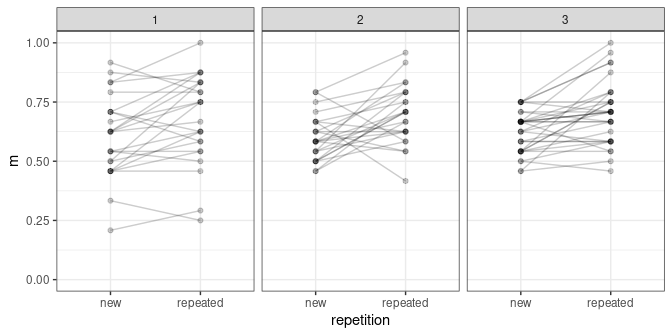

Importing/Converting data from Fazio & Sherry (2020)
================
Dale Barr
September 10, 2020

Pre-processing of data files from the article:

Fazio, L. K. & Sherry, C. L. (2020). [The Effect of Repetition on Truth
Judgments Across
Development](https://doi.org/10.1177%2F0956797620939534), *Psychological
Science*.

To run this script, you need to first download the authors’ CSV file at
<https://osf.io/cngzu/> and store it as `IT_kid_FINAL.csv` in the same
directory as this script.

This script creates four CSV files:

  - `subjects.csv` : information about individual subjects
  - `truth_judgments.csv` : all the raw truth judgments
  - `confidence_ratings.csv` : all the raw confidence ratings
  - `list_cond.csv` : Maps item\_id and subject list onto experimental
    condition

To run it, type `rmarkdown::render("convert.Rmd")` at the R command
line.

# Import and transform the data

## Import

``` r
library("tidyverse")
```

    ## ── Attaching packages ─────────────────────────────────────── tidyverse 1.3.0 ──

    ## ✔ ggplot2 3.3.2     ✔ purrr   0.3.4
    ## ✔ tibble  3.0.3     ✔ dplyr   1.0.2
    ## ✔ tidyr   1.1.1     ✔ stringr 1.4.0
    ## ✔ readr   1.3.1     ✔ forcats 0.5.0

    ## ── Conflicts ────────────────────────────────────────── tidyverse_conflicts() ──
    ## ✖ dplyr::filter() masks stats::filter()
    ## ✖ dplyr::lag()    masks stats::lag()

``` r
import <- function() {
  read_csv(
    "IT_kid_FINAL.csv",
    col_types = cols(
      gender = col_character(),
      age = col_double(),
      n_c_e = col_double(),
      n_c_m = col_double(),
      n_c_h = col_double(),
      n_i_e = col_double(),
      n_i_m = col_double(),
      n_i_h = col_double(),
      r_c_e = col_double(),
      r_c_m = col_double(),
      r_c_h = col_double(),
      r_i_e = col_double(),
      r_i_m = col_double(),
      r_i_h = col_double(),
      not_tested_c = col_double(),
      tested_c = col_double(),
      not_tested_i = col_double(),
      tested_i = col_double(),
      not_tested = col_double(),
      tested = col_double(),
      s_n_c_e = col_double(),
      s_n_c_m = col_double(),
      s_n_c_h = col_double(),
      s_n_i_e = col_double(),
      s_n_i_m = col_double(),
      s_n_i_h = col_double(),
      s_r_c_e = col_double(),
      s_r_c_m = col_double(),
      s_r_c_h = col_double(),
      s_r_i_e = col_double(),
      s_r_i_m = col_double(),
      s_r_i_h = col_double(),
      s_not_tested_c = col_double(),
      s_tested_c = col_double(),
      s_not_tested_i = col_double(),
      s_tested_i = col_double(),
      s_not_tested = col_double(),
      s_tested = col_double(),
      easy_new = col_double(),
      easy_repeated = col_double(),
      med_new = col_double(),
      med_repeated = col_double(),
      hard_new = col_double(),
      hard_repeated = col_double(),
      .default = col_integer()))
}

dat <- import()

head(dat)
```

    ## # A tibble: 6 x 191
    ##   subject gender agegroup   age  cond    T1    T2    T3    T4    T5    T6    T7
    ##     <int> <chr>     <int> <dbl> <int> <int> <int> <int> <int> <int> <int> <int>
    ## 1     102 M             1  5.57     2     1     1     1     1     1     0     1
    ## 2     104 M             1  5.61     4     1     0     1     0     0     0     0
    ## 3     105 M             1  5.5      1     1     1     1     1     0     0     0
    ## 4     106 M             1  5.82     2     1     1     1     1     1     1     1
    ## 5     107 F             1  5.48     3     1     1     1     1     1     1     1
    ## 6     109 M             1  5.48     1     1     1     1     0     0     1     1
    ## # … with 179 more variables: T8 <int>, T9 <int>, T10 <int>, T11 <int>,
    ## #   T12 <int>, T13 <int>, T14 <int>, T15 <int>, T16 <int>, T17 <int>,
    ## #   T18 <int>, T19 <int>, T20 <int>, T21 <int>, T22 <int>, T23 <int>,
    ## #   T24 <int>, T25 <int>, T26 <int>, T27 <int>, T28 <int>, T29 <int>,
    ## #   T30 <int>, T31 <int>, T32 <int>, T33 <int>, T34 <int>, T35 <int>,
    ## #   T36 <int>, T37 <int>, T38 <int>, T39 <int>, T40 <int>, T41 <int>,
    ## #   T42 <int>, T43 <int>, T44 <int>, T45 <int>, T46 <int>, T47 <int>,
    ## #   T48 <int>, C1 <int>, C2 <int>, C3 <int>, C4 <int>, C5 <int>, C6 <int>,
    ## #   C7 <int>, C8 <int>, C9 <int>, C10 <int>, C11 <int>, C12 <int>, C13 <int>,
    ## #   C14 <int>, C15 <int>, C16 <int>, C17 <int>, C18 <int>, C19 <int>,
    ## #   C20 <int>, C21 <int>, C22 <int>, C23 <int>, C24 <int>, C25 <int>,
    ## #   C26 <int>, C27 <int>, C28 <int>, C29 <int>, C30 <int>, C31 <int>,
    ## #   C32 <int>, C33 <int>, C34 <int>, C35 <int>, C36 <int>, C37 <int>,
    ## #   C38 <int>, C39 <int>, C40 <int>, C41 <int>, C42 <int>, C43 <int>,
    ## #   C44 <int>, C45 <int>, C46 <int>, C47 <int>, C48 <int>, n_c_e <dbl>,
    ## #   n_c_m <dbl>, n_c_h <dbl>, n_i_e <dbl>, n_i_m <dbl>, n_i_h <dbl>,
    ## #   r_c_e <dbl>, r_c_m <dbl>, r_c_h <dbl>, r_i_e <dbl>, r_i_m <dbl>, …

## Transform and identify experimental conditions

### truth judgments: wide to long

``` r
# - n/r: n = new, r = repeated
# - c/i: ground truth c = correct, i = incorrect???
# - e/m/h: e = easy, m = medium, h = hard

raw_long_dat <- dat %>%
  select(subject, T1:T48) %>%
  pivot_longer(cols = c(-subject),
               names_to = "statement", values_to = "response") %>%
  separate(statement, c("junk", "item_id"), 1L, convert = TRUE) %>%
  select(-junk) %>%
  mutate(set = as.integer(floor((item_id - 1L) / 4L)) + 1L)

write_csv(raw_long_dat %>% select(-set), "truth_judgments.csv")
```

### confidence judgments: wide to long

``` r
conf_long <- dat %>%
  select(subject, S1:S48) %>%
  pivot_longer(cols = c(-subject),
               names_to = "statement", values_to = "response") %>%
  separate(statement, c("junk", "item_id"), 1L, convert = TRUE) %>%
  select(-junk)

write_csv(conf_long, "confidence_ratings.csv")
```

### subject information

``` r
dat %>%
  select(subject, cond, gender, agegroup, age) %>%
  write_csv("subjects.csv")
```

### derive list information

``` r
item_inf <- distinct(raw_long_dat, item_id, set)

stat_long <- dat %>%
  select(subject, n_c_e:r_i_h) %>%
  pivot_longer(c(-subject), names_to = "stat")

lookup <- stat_long %>%
  distinct(stat) %>%
  mutate(stat_id = row_number()) %>%
  select(stat_id, stat)

lookup2 <- lookup %>%
  mutate(stat_id = c(7:12, 1:6))

lookup3 <- lookup %>%
  mutate(stat_id = c(4:12, 1:3))

lookup4 <- lookup %>%
  mutate(stat_id = c(10:12, 1:9))

list_info <- bind_rows(lookup %>%
                       mutate(cond = 1L),
                       lookup2 %>%
                       mutate(cond = 3L),
                       lookup3 %>%
                       mutate(cond = 2L),
                       lookup4 %>%
                       mutate(cond = 4L)) %>%
  rename(set = stat_id) %>%
  select(cond, everything()) %>%
  separate("stat", c("rep", "gt", "diff"), "_", remove = FALSE) %>%
  mutate(
    ground_truth = if_else(gt == "c", "true", "false") %>%
      fct_relevel("true"),
    repetition = if_else(rep == "r", "repeated", "new") %>%
      fct_relevel("new"),
    knowledge_level = case_when(diff == "e" ~ "preschool",
                                diff == "m" ~ "elementary",
                                TRUE ~ "middle") %>%
      fct_relevel(c("preschool", "elementary", "middle"))) %>%
  select(-gt, -rep, -diff)

inner_join(list_info, item_inf, "set") %>%
  select(cond, item_id, everything()) %>%
  arrange(cond, item_id) %>%
  write_csv("list_cond.csv")
```

# Validate

Check that stats from the new, transformed data matches the Fazio &
Sherry stats.

Calculate statistics from the raw data and verify that they match these
columns in the original data for every subject:

  - `n_c_e`
  - `n_c_m`
  - `n_c_h`
  - `n_i_e`
  - `n_i_m`
  - `n_i_h`
  - `r_c_e`
  - `r_c_m`
  - `r_c_h`
  - `r_i_e`
  - `r_i_m`
  - `r_i_h`

If they match, this document will compile. If not, it will throw an
error.

## Starter code

If you want to perform any analyses using the raw data, include this R
code at the top of your script.

``` r
library("tidyverse")

## the following lines load in all of the data
subj <- read_csv("subjects.csv", col_types = "iicid")
truth_raw <- read_csv("truth_judgments.csv", col_types = "iii")
conf_raw <- read_csv("confidence_ratings.csv", col_types = "iii")
list_cond <- read_csv("list_cond.csv", col_types = "iiicfff") %>%
  mutate(ground_truth = fct_relevel(ground_truth, "true"),
         repetition = fct_relevel(repetition, "new"),
         knowledge_level = fct_relevel(knowledge_level, "preschool", "elementary"))

## truth ratings combined table
truth <- truth_raw %>%
  inner_join(subj, "subject") %>%
  inner_join(list_cond, c("cond", "item_id"))

## confidence ratings combined table
conf <- conf_raw %>%
  inner_join(subj, "subject") %>%
  inner_join(list_cond, c("cond", "item_id"))
```

## validate by matching the statistics

``` r
dat <- import()

## reconstruct the data
reconstructed <- truth_raw %>%
  inner_join(subj %>% select(subject, cond), "subject") %>%
  inner_join(list_cond, c("cond", "item_id")) %>%
  group_by(subject, stat) %>%
  summarize(m = mean(response), .groups = "drop")

## make original in long format
orig <- dat %>%
  select(subject, n_c_e:r_i_h) %>%
  pivot_longer(c(-subject), names_to = "stat", values_to = "m")

## are they the same?
did_match <- setequal(orig, reconstructed)

## if not, then this statement will fail during compilation
stopifnot(did_match)
```

**Did the transformed data match the original data? YES**

## validate by reproducing the graph

``` r
truth %>%
  group_by(subject, agegroup, repetition) %>%
  summarize(m = mean(response), .groups = "drop") %>%
  ggplot(aes(repetition, m)) +
  geom_point(alpha = .2) +
  geom_line(aes(group = subject), alpha = .2) +
  facet_wrap(~ agegroup, nrow = 1L) +
  theme_bw() +
  coord_cartesian(ylim = c(0, 1))
```

<!-- -->

# R Session Information

``` r
sessionInfo()
```

    ## R version 4.0.2 (2020-06-22)
    ## Platform: x86_64-pc-linux-gnu (64-bit)
    ## Running under: Ubuntu 20.04.1 LTS
    ## 
    ## Matrix products: default
    ## BLAS:   /usr/lib/x86_64-linux-gnu/blas/libblas.so.3.9.0
    ## LAPACK: /usr/lib/x86_64-linux-gnu/lapack/liblapack.so.3.9.0
    ## 
    ## locale:
    ##  [1] LC_CTYPE=en_US.UTF-8       LC_NUMERIC=C              
    ##  [3] LC_TIME=en_US.UTF-8        LC_COLLATE=en_US.UTF-8    
    ##  [5] LC_MONETARY=en_US.UTF-8    LC_MESSAGES=en_US.UTF-8   
    ##  [7] LC_PAPER=en_US.UTF-8       LC_NAME=C                 
    ##  [9] LC_ADDRESS=C               LC_TELEPHONE=C            
    ## [11] LC_MEASUREMENT=en_US.UTF-8 LC_IDENTIFICATION=C       
    ## 
    ## attached base packages:
    ## [1] stats     graphics  grDevices utils     datasets  methods   base     
    ## 
    ## other attached packages:
    ## [1] forcats_0.5.0   stringr_1.4.0   dplyr_1.0.2     purrr_0.3.4    
    ## [5] readr_1.3.1     tidyr_1.1.1     tibble_3.0.3    ggplot2_3.3.2  
    ## [9] tidyverse_1.3.0
    ## 
    ## loaded via a namespace (and not attached):
    ##  [1] tidyselect_1.1.0 xfun_0.16        haven_2.3.1      lattice_0.20-41 
    ##  [5] colorspace_1.4-1 vctrs_0.3.2      generics_0.0.2   htmltools_0.5.0 
    ##  [9] yaml_2.2.1       utf8_1.1.4       blob_1.2.1       rlang_0.4.7     
    ## [13] pillar_1.4.6     glue_1.4.1       withr_2.2.0      DBI_1.1.0       
    ## [17] dbplyr_1.4.4     modelr_0.1.8     readxl_1.3.1     lifecycle_0.2.0 
    ## [21] munsell_0.5.0    gtable_0.3.0     cellranger_1.1.0 rvest_0.3.5     
    ## [25] evaluate_0.14    labeling_0.3     knitr_1.29       fansi_0.4.1     
    ## [29] broom_0.5.6      Rcpp_1.0.4.6     scales_1.1.1     backports_1.1.8 
    ## [33] jsonlite_1.7.0   farver_2.0.3     fs_1.4.1         hms_0.5.3       
    ## [37] digest_0.6.25    stringi_1.4.6    grid_4.0.2       cli_2.0.2       
    ## [41] tools_4.0.2      magrittr_1.5     crayon_1.3.4     pkgconfig_2.0.3 
    ## [45] ellipsis_0.3.1   xml2_1.3.2       reprex_0.3.0     lubridate_1.7.9 
    ## [49] assertthat_0.2.1 rmarkdown_2.3    httr_1.4.1       rstudioapi_0.11 
    ## [53] R6_2.4.1         nlme_3.1-147     compiler_4.0.2
